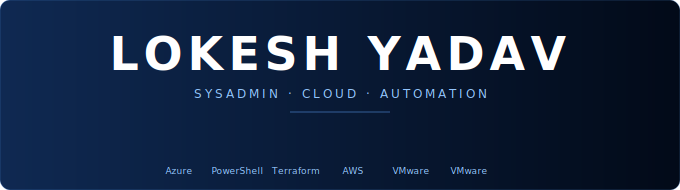

  

<svg width="100%" viewBox="0 0 680 190" xmlns="http://www.w3.org/2000/svg" role="img">
<title>Lokesh Yadav Banner</title>
<defs>
  <linearGradient id="bg" x1="0%" y1="0%" x2="100%" y2="0%">
    <stop offset="0%" style="stop-color:#0f2952"/>
    <stop offset="100%" style="stop-color:#020a18"/>
  </linearGradient>
</defs>

<rect width="680" height="190" fill="url(#bg)" rx="10"/>
<rect width="680" height="190" fill="none" stroke="#60a5fa" stroke-width="0.8" rx="10" opacity="0.3"/>

<text x="340" y="70" text-anchor="middle"
  font-family="'Segoe UI', system-ui, sans-serif"
  font-size="46" font-weight="700"
  fill="#ffffff" letter-spacing="5">LOKESH YADAV</text>

<text x="340" y="98" text-anchor="middle"
  font-family="'Segoe UI', system-ui, sans-serif"
  font-size="12" letter-spacing="3"
  fill="#93c5fd">SYSADMIN · CLOUD · AUTOMATION</text>

<line x1="290" y1="112" x2="390" y2="112" stroke="#60a5fa" stroke-width="1" opacity="0.5"/>

<image href="https://cdn.jsdelivr.net/gh/devicons/devicon/icons/azure/azure-original.svg" x="161" y="126" width="36" height="36"/>
<image href="https://cdn.jsdelivr.net/gh/devicons/devicon/icons/powershell/powershell-original.svg" x="219" y="126" width="36" height="36"/>
<image href="https://cdn.jsdelivr.net/gh/devicons/devicon/icons/terraform/terraform-original.svg" x="277" y="126" width="36" height="36"/>
<image href="https://cdn.jsdelivr.net/gh/devicons/devicon/icons/amazonwebservices/amazonwebservices-plain-wordmark.svg" x="335" y="126" width="36" height="36"/>
<image href="https://cdn.jsdelivr.net/gh/devicons/devicon/icons/vmware/vmware-original.svg" x="393" y="126" width="36" height="36"/>
<image href="https://cdn.jsdelivr.net/gh/devicons/devicon/icons/vmware/vmware-original.svg" x="451" y="126" width="36" height="36"/>

<text x="179" y="174" text-anchor="middle" font-family="'Segoe UI',sans-serif" font-size="9" fill="#93c5fd">Azure</text>
<text x="237" y="174" text-anchor="middle" font-family="'Segoe UI',sans-serif" font-size="9" fill="#93c5fd">PowerShell</text>
<text x="295" y="174" text-anchor="middle" font-family="'Segoe UI',sans-serif" font-size="9" fill="#93c5fd">Terraform</text>
<text x="353" y="174" text-anchor="middle" font-family="'Segoe UI',sans-serif" font-size="9" fill="#93c5fd">AWS</text>
<text x="411" y="174" text-anchor="middle" font-family="'Segoe UI',sans-serif" font-size="9" fill="#93c5fd">VMware</text>
<text x="469" y="174" text-anchor="middle" font-family="'Segoe UI',sans-serif" font-size="9" fill="#93c5fd">VMware</text>

</svg>
